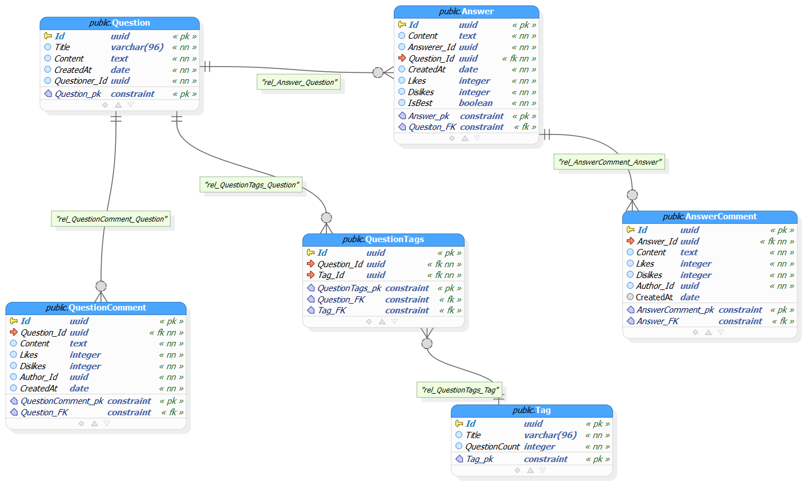
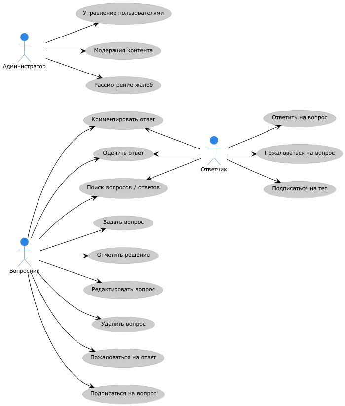

### **1. Техническое задание**

**Документы:**

- [Назначение программы](./Назначение.md)

  - **Название**: "QAProphet" (система вопросов и ответов).
  - **Цель**: Автоматизация обсуждения вопросов, повышение эффективности работы, снижение ошибок.
  - **Сфера применения**: Внутренние или публичные Q&A-платформы.

- [Функциональные требования](./ФункциональныеТребования.md)

  - **Основные функции**:
    - Создание/управление вопросами и ответами.
    - Поиск по тегам и ключевым словам.
    - Модерация контента (для администраторов).
  - **User Stories**:
    - Пользователи: задание вопросов, оценка ответов, подписки.
    - Администраторы: бан пользователей, удаление контента.
    - Подробнее см. [UserStory.md](./UserStory.md).

- [Нефункциональные требования](./НефункциональныеТребования.md)
  - **Безопасность**: HTTPS, защита от SQL-инъекций.
  - **Масштабируемость**: Вертикальное масштабирование.

---

### **2. План внедрения**

**Этапы:**

1. **Подготовка инфраструктуры:**
   - Установка Docker (см. [Развертывание](./Развертывание.md)).
2. **Запуск сервисов:**
   ```bash
   docker compose up --build -d
   ```
3. **Тестирование:**
   - Интеграционные тесты с использованием `TestContainers` и `Respawn`
4. **Мониторинг:**
   - Внедрение `Seq` для логов.

**Сроки**: 1-2 недели.

---

### **3. План разработки**

**Этапы:**

1. **Бэкенд (3 недели):**
   - Реализация API на ASP.NET Core 9 (паттерн REPR).
   - Интеграция с Keycloak для аутентификации.
2. **Тестирование (2 недели):**
   - Интеграционные тесты с TestContainers (примеры в [Тестах](./Тесты.md)).
3. **Документация:**
   - Руководства для пользователей и разработчиков.

**Инструменты:**

- Бэкенд: Entity Framework Core, Elasticsearch, PostgreSQL, EF Core, Keycloak.
- Тестирование: xUnit,TestContaineres, Respawn для сброса БД между тестами.

---

### **4. Документация для разработчиков**

**Соглашения:**

- **Архитектура**: Вертикальные срезы (Vertical Slice) — каждый UseCase в одном месте.
- **Тестирование**:
  - Фикстура `DbConnectionFixture` для работы с тестовой БД.
  - Пример теста:
    ```csharp
    [Fact]
    public async Task Handle_ReturnsValidationError_WhenTagNotFound() { ... }
    ```
- **Сборка**:

  ```bash
  docker compose up --build -d
  ```

- Схема БД — структура таблиц.
  
 

- [Диаграмма классов](./Diagrams/class.png) — основные компоненты системы.

 

**Настройка окружения:**

- **Keycloak**: Для аутентификации.
- **Elasticsearch**: Для поиска вопросов.

---

### **5. Документация для пользователей**

**Основные функции:**

1. **Работа с вопросами:**
   - `GET /api/questions` — список вопросов.
   - `POST /api/questions` — создать вопрос.
2. **Поиск:**
   - `GET /api/search?s=текст` — поиск по ключевым словам.
3. **Безопасность:**
   - Аутентификация через JWT-токены.

- взаимодействие пользователей.

 

**Пример запроса:**

```http
POST /api/questions HTTP/1.1
Content-Type: application/json
{
  "title": "Как настроить Docker?",
  "tags": [...]
}
```

---

### **6. Документация для внедрения**

**Установка:**

1. Требования:
   - Docker Desktop.
2. Запуск:
   ```bash
   docker compose up --build -d
   ```
   **Конфигурация:**

- Настройки БД и Keycloak в `appsettings.json`.

---

### **7. Анализ рисков**

| Риск               | Вероятность | Влияние     | Митигация                             |
| ------------------ | ----------- | ----------- | ------------------------------------- |
| Перегрузка сервера | Средняя     | Высокое     | Автомасштабирование                   |
| Утечка данных      | Низкая      | Критическое | Шифрование (TLS 1.3)                  |
| Недостаток тестов  | Высокая     | Среднее     | Интеграционные тесты с TestContainers |

---

### **8. Пример принятия заявки**

**Форма запроса:**

```markdown
**Тема:** Добавление Markdown-редактора  
**Описание:** Хочу форматировать вопросы с помощью Markdown.  
**Приоритет:** Высокий  
**Статус:** В бэклоге
```

- Обсуждение в GitHub Issues.

- При одобрении — реализация в следующем спринте.
